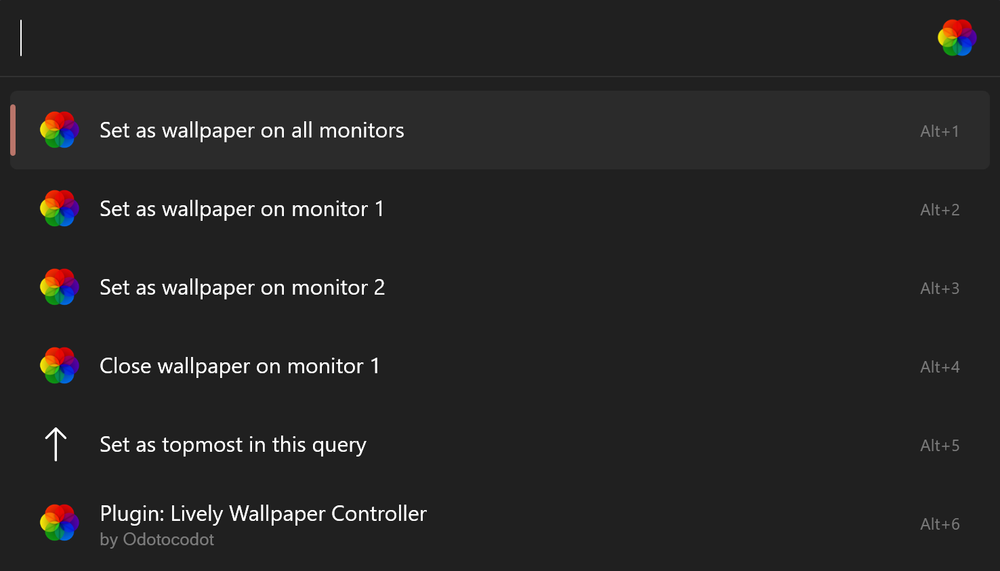

<p align="center">
  <a href="https://flowlauncher.com">
    
  </a>
  <a href="https://www.rocksdanister.com/lively/">
    
  </a>
</p>
<h1 align="center">Lively Wallpaper for Flow Launcher</h1>

A [Lively Wallpaper](https://www.rocksdanister.com/lively/) plugin
for [Flow launcher](https://github.com/Flow-Launcher/Flow.Launcher), allowing for the ability to quickly change your
wallpaper and more!

## Installation

Using Flow Launcher type:

```
pm install Lively Wallpaper Controller
```

The first time the plugin runs it will attempt to automatically find your Lively Wallpaper `Settings.json` file.

<details>
  <summary>Troubleshooting</summary>

If the plugin does not work out of the box, head to the plugin settings and make sure the `Settings.json` path and the
type of installation is correct.

| Installation Type | Typical `Settings.json` Path                                                                                                |
|-------------------|-----------------------------------------------------------------------------------------------------------------------------|
| GitHub            | `%APPDATA%\Local\Lively Wallpaper\Settings.json`                                                                            |
| Microsoft Store   | `%APPDATA%\Local\Packages\12030rocksdanister.LivelyWallpaper_97hta09mmv6hy\LocalCache\Local\Lively Wallpaper\Settings.json` |

</details>

## Features

See all your lively wallpapers and change your current one quickly.

```
lw {your search}
```


For a multi monitor with the wallpaper layout on `per monitor` use the context menu on results to choose a specific monitor.



### Commands

The plugin has a set of commands available so don't have to navigate to Lively every time.

| Command Keyword | Action                                                                |
|-----------------|-----------------------------------------------------------------------|
| `setwp`         | Search and set wallpapers                                             |
| `random`        | Set a random wallpaper                                                |
| `closewp`       | Close a wallpaper                                                     |
| `volume`        | Set wallpaper volume                                                  |
| `layout`        | Change the layout of wallpapers (`per monitor`, `span` & `duplicate`) |
| `playback`      | Pause or play wallpaper playback                                      |
| `show`          | Unminimize the Lively Wallpaper application                           |
| `quit`          | Quit Lively Wallpaper                                                 |


> [!IMPORTANT]
>
> Lively Wallpaper must be running (in the background) for the commands to function properly.

## Additional Information

This plugin comes with the [Lively Command Utility](https://github.com/rocksdanister/lively/releases/tag/v2.0.4.0)
installed.
This allows easy use of the lively [command line](https://github.com/rocksdanister/lively/wiki/Command-Line-Controls)
without needing the path to the Lively exe.